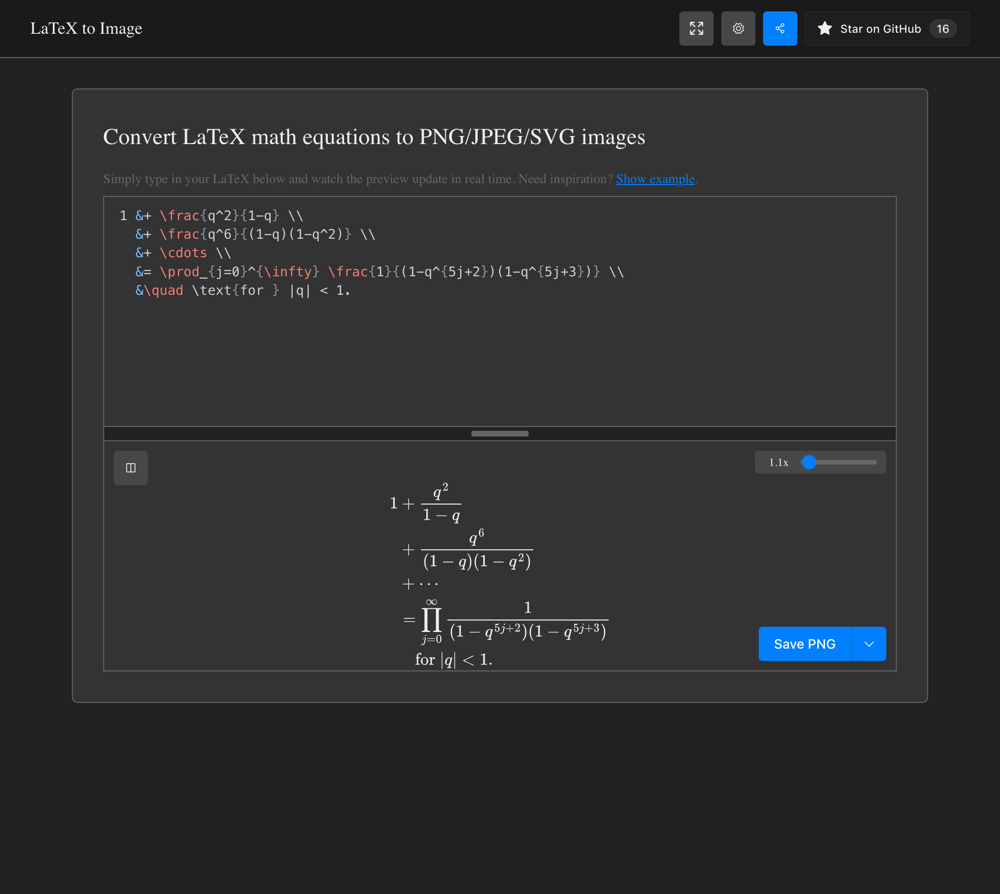

# LaTeX to Image

[](https://thomasahle.com/latex2png)

A fast, modern web app to convert LaTeX math equations to PNG, JPEG, SVG, and PDF images. **[Try it live →](https://thomasahle.com/latex2png)**

## Development

```bash
# Install dependencies
npm install

# Run dev server
npm run dev

# Build for production
npm run build
```

## Testing

Install Chromium once with `npx playwright install chromium`. Start the built
site in one terminal with `npm run preview -- --host 127.0.0.1 --port 4173`,
then run the full suite in another:

```bash
SNAP_BASE_URL=http://127.0.0.1:4173/latex2png/ npm test
```

This checks render races, immediate exports and copies, error recovery,
accessible math, keyboard navigation, mobile layouts, export snapshots in both
themes, and every symbol. `npm run test:unit` needs no browser or server.
The UI suite also checks export settings, remembered pane sizes and workspace
height, pointer and keyboard resizing, reset, and fullscreen entry/exit
(including menu and Vim keyboard behavior).
`npm run test:drag` checks cursor-preview dimensions and grab points at 1–5×
zoom and pixel densities of 1, 1.5, 2, and 3, while ensuring the dropped PNG
retains the same full-resolution pixels as a download.
`npm run test:persistence` restarts Chromium with the same browser profile to
check that both resizers, each layout's split, and resets survive later visits.
`npm run generate:symbols` validates and regenerates the menu icons.
Update export baselines deliberately with `UPDATE_SNAPSHOTS=1 npm run test:snap`.
Export snapshots use a fixed viewport, pixel density, and bundled font. Exact
references are stored separately for macOS (`darwin`) and Linux because browser
font metrics and rasterization still differ by OS. Updating snapshots changes
only the current platform's references; review those exports before committing.

Pull requests and main-branch pushes run these checks against the production
build. Pages deployment depends on all checks passing.

## License

GPL-3.0

---

Built by [@thomasahle](https://github.com/thomasahle)
